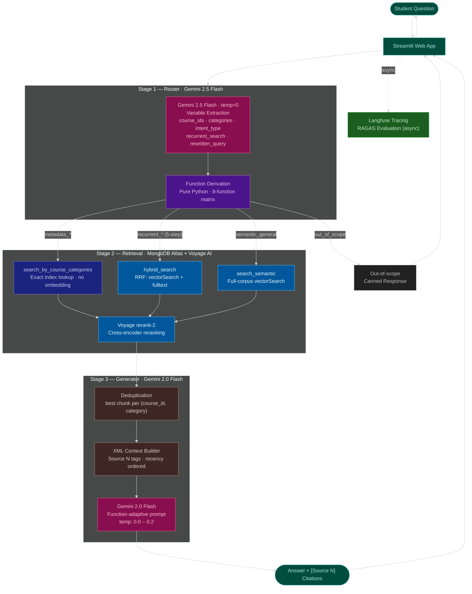
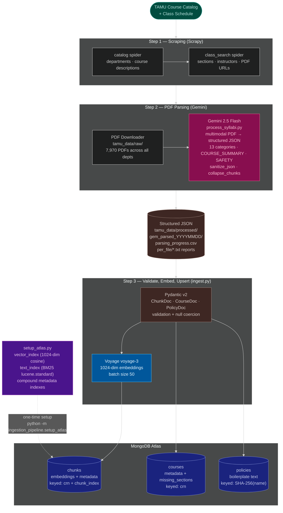
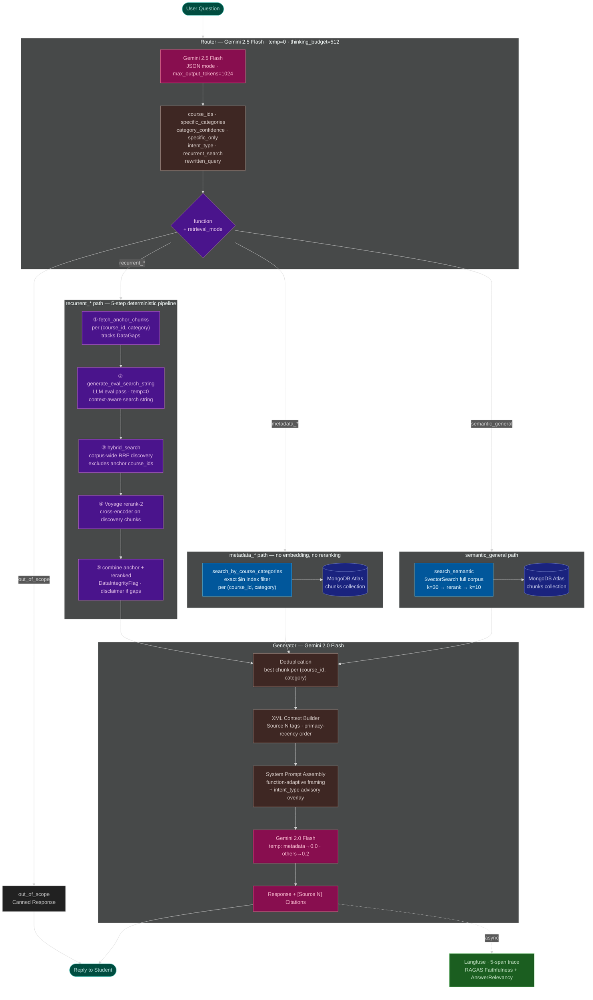

# TamuBot — Texas A&M Academic Assistant

A RAG-based chatbot that answers questions about TAMU courses, syllabi, grading policies, schedules, and university policies. Built on MongoDB Atlas, Voyage AI, and Gemini.

**Tech stack:** Streamlit · MongoDB Atlas · Voyage AI (voyage-3 embeddings + rerank-2) · Gemini 2.5 Flash (router) · Gemini 2.0 Flash (parser + generator) · Langfuse (observability) · RAGAS (evaluation) · Scrapy · Pydantic v2

---

## High-Level System Flow



---

## Ingestion Pipeline

One-time ETL: scrape → parse → embed → store. Controlled by `ingestion_pipeline/`.



### Ingestion Commands

```bash
# One-time: create Atlas vector + text + compound indexes
python -m ingestion_pipeline.setup_atlas

# Embed and ingest all parsed JSONs (skips error files automatically)
python -m ingestion_pipeline.ingest

# Single department only
python -m ingestion_pipeline.ingest --department CSCE

# Preview without writing (no MongoDB/Voyage calls)
python -m ingestion_pipeline.ingest --dry-run

# Retry previously failed PDF parses (scans gem_parsed_YYYYMMDD/ for error JSONs)
GOOGLE_API_KEY=... python -m ingestion_pipeline.refine_errors [--department CSCE]
```

### Per-Run Artifacts

| File | Description |
|---|---|
| `tamu_data/processed/gem_parsed_YYYYMMDD/*.json` | One structured JSON per PDF |
| `tamu_data/processed/gem_parsed_YYYYMMDD/parsing_progress.csv` | Live progress sheet — updates after every file. Columns: status, error type, token count per category, flags for over/undersized chunks |
| `tamu_data/logs/per_file/<stem>.txt` | Human-readable report per PDF (OK: chunk list + missing sections; FAILED: error + attempts) |
| `tamu_data/logs/errors.jsonl` | Per-attempt error log |
| `tamu_data/logs/refine_errors.jsonl` | Failures from `refine_errors.py` reruns |

### Parsed JSON Schema

```json
{
  "course_metadata": {
    "course_id": "CSCE 638",
    "section": "500",
    "term": "202611",
    "crn": "12345",
    "instructor": { "name": "...", "email": "...", "office_hours": "..." },
    "teaching_assistants": [],
    "meeting_times": "MWF 10:20–11:10",
    "location": "HRBB 124",
    "course_url": "https://canvas.tamu.edu/courses/..."
  },
  "chunks": [
    { "category": "GRADING", "title": "Grade Breakdown", "content": "...", "has_table": true },
    { "category": "SAFETY", "title": "Lab Safety Rules", "content": "...", "has_table": false },
    { "category": "COURSE_SUMMARY", "title": "Course Summary", "content": "CSCE 638 | NLP | Spring 2026\nTopics: transformers, BERT, LLMs...\nMethods: fine-tuning, RAG...", "has_table": false }
  ],
  "boilerplate_policies": ["Academic Integrity Policy", "ADA Accommodation"],
  "completeness_check": {
    "missing_sections": ["SCHEDULE"],
    "warnings": ["Grading percentages do not sum to 100%"]
  },
  "_source_file": "202611_CSCE_638_600_54988.pdf",
  "_parsed_at": "2026-03-04T10:00:00"
}
```

### 13 Categories

| Category | Description |
|---|---|
| `COURSE_OVERVIEW` | Course description, catalog info, special designations |
| `COURSE_SUMMARY` | **Always generated.** RAG keyword-dense index: Topics / Methods / Prerequisites / Tools / Niche. ~200–280 tokens, no narrative prose. |
| `INSTRUCTOR` | Instructor/TA details (if not fully captured in `course_metadata`) |
| `PREREQUISITES` | Required courses, corequisites, standing requirements |
| `LEARNING_OUTCOMES` | What students will learn, course objectives |
| `MATERIALS` | Textbooks, software, platforms, tech requirements |
| `GRADING` | Grade scale, weights, component descriptions, rubrics, appeals |
| `SCHEDULE` | Course calendar, weekly topics, exam dates, due dates |
| `ATTENDANCE_AND_MAKEUP` | Attendance rules, late work policy, makeup exams |
| `AI_POLICY` | AI tool usage rules, citation requirements |
| `UNIVERSITY_POLICIES` | Standard TAMU boilerplate (ADA, FERPA, Title IX, Honor Code) |
| `SUPPORT_SERVICES` | IT help, Canvas support, tutoring, writing center |
| `SAFETY` | **Lab/hands-on courses only.** PPE, chemical handling, emergency procedures, equipment rules. |

---

## Query Pipeline (Detailed)



---

## Router — Variable Extraction Schema

The router is a single Gemini 2.5 Flash call that **extracts structured facts** from the query. There is no intent classification step — the retrieval function is derived mechanically from the extracted variables in pure Python.

### Variables Extracted by the LLM

| Variable | Type | Description |
|---|---|---|
| `course_ids` | `list[str]` | Normalized course IDs found in query (e.g. `["CSCE 638", "CSCE 670"]`) |
| `specific_categories` | `list[str]` | Syllabus categories being asked about (e.g. `["GRADING", "AI_POLICY"]`) |
| `category_confidence` | `float 0–1` | Confidence in the category extraction |
| `specific_only` | `bool` | `True` → the query asks *only* about those categories (not a broad overview) |
| `intent_type` | `str \| None` | Advisory/evaluative dimension: `ACADEMIC · CAREER · DIFFICULTY · PLANNING · ADMINISTRATIVE · GENERAL`; `null` for factual/off-topic |
| `recurrent_search` | `bool` | `True` → user wants to discover unknown courses anchored to a named course |
| `rewritten_query` | `str` | Expanded for retrieval (synonyms, slang expansion) |
| `section` | `str \| None` | Section number if mentioned |

### Function Derivation Matrix (pure Python)

| `course_ids` | `recurrent_search` | `intent_type` | `specific_categories` | `specific_only` | **function** |
|---|---|---|---|---|---|
| empty | any | not `null` | any | any | `semantic_general` |
| empty | any | `null` | any | any | `out_of_scope` |
| present | `True` | any | empty | — | `recurrent_default` |
| present | `True` | any | populated | `True` | `recurrent_specific` |
| present | `True` | any | populated | `False` | `recurrent_combined` |
| present | `False` | any | empty | — | `metadata_default` |
| present | `False` | any | populated | `True` | `metadata_specific` |
| present | `False` | any | populated | `False` | `metadata_combined` |

### Retrieval Mode Derivation (pure Python)

```
retrieval_mode = "semantic"  if course_ids is empty
               = "hybrid"    if recurrent_search = True
               = "metadata"  otherwise
```

**Metadata path** → `search_by_course_categories()` — exact index lookup, no embedding, no reranking.
**Recurrent path (5-step)** → anchor metadata fetch → LLM eval pass → corpus hybrid discovery → rerank → combine.
**Semantic path** → `search_semantic()` — `$vectorSearch` over full corpus, then rerank-2.

**Multi-course** (`len(course_ids) > 1`, non-recurrent): parallel per-course fetch → `generate_comparison()` (single structured LLM call + Python Markdown render).

### Retrieval Config Per Function

| Function | retrieve_k | rerank_k | Notes |
|---|---|---|---|
| `metadata_default` | 10 | 0 | No reranking (exact lookup) |
| `metadata_specific` | 10 | 0 | No reranking (exact lookup) |
| `metadata_combined` | 10 | 0 | No reranking (exact lookup) |
| `semantic_general` | 30 | 10 | Full corpus search |
| `recurrent_default` | 12 | 3 | 5-step pipeline, per anchor course |
| `recurrent_specific` | 10 | 3 | 5-step pipeline, per anchor course |
| `recurrent_combined` | 15 | 4 | 5-step pipeline, per anchor course |

### Default Summary Categories

When `specific_categories` is empty (or for the `*_combined` base), the system fetches:

```python
DEFAULT_SUMMARY_CATEGORIES = ["COURSE_OVERVIEW", "PREREQUISITES", "LEARNING_OUTCOMES"]
```

### Query Rewriting Rules

| Slang / shorthand | Expanded to |
|---|---|
| "late work" | "attendance makeup deadline extensions late submission" |
| "ChatGPT", "AI tools" | "AI policy artificial intelligence generative AI tools" |
| "prereqs" | "prerequisites required courses corequisites" |
| "prof", "teacher" | "instructor professor" |
| "grade breakdown" | "grading policy grade distribution weight percentage" |

Course IDs are normalized: `csce638` → `CSCE 638`, `CSCE-670` → `CSCE 670`.

---

## Generator Behavior

Each function gets a tailored system prompt and temperature. An advisory overlay from `intent_type` is appended for `recurrent_*` and `semantic_general` functions.

### Function Prompts

| Function | Temp | Framing |
|---|---|---|
| `metadata_default` | 0.0 | General course overview — covers overview, prerequisites, learning outcomes |
| `metadata_specific` | 0.0 | Focused on requested categories — precise and complete |
| `metadata_combined` | 0.0 | Specific categories in context of full overview |
| `semantic_general` | 0.2 | Broad question — search-based answer, flags insufficient evidence |
| `recurrent_default` | 0.2 | Course discovery — explains what makes each discovered course a complement |
| `recurrent_specific` | 0.2 | Discovery + specific category — uses category evidence for pairing rationale |
| `recurrent_combined` | 0.2 | Discovery + overview — broad anchor context + pairing reasoning |

### Intent Type Advisory Overlays

Appended to the system prompt for `recurrent_*` and `semantic_general` functions:

| `intent_type` | Advisory instruction |
|---|---|
| `ACADEMIC` | Discuss learning outcomes, topics covered, academic content |
| `CAREER` | Discuss how course content relates to industry applications and career paths |
| `DIFFICULTY` | Use grading weights, prerequisites, attendance requirements as evidence of rigor |
| `PLANNING` | Help the student understand course fit in their academic progression |
| `GENERAL` | Address the advisory aspect using evidence from the course context |

### Data Integrity Disclaimer

When a `recurrent_*` query finds missing (course_id, category) pairs in the DB (`DataGaps`), the generator prepends:
```
⚠️ Note: The following data was not found in the syllabus database:
- CSCE 638 / PREREQUISITES
```

**Multi-course overlay:** when `len(course_ids) > 1`, a comparison instruction is automatically appended (Markdown table, no alignment padding, `[Source N]` citations per cell).

**Recency bias:** results are reversed before context formatting so the highest-ranked chunk sits directly above the user question.

**Verification rule (global):** the model must identify which chunk contains the answer before responding. If none do, it states "I cannot find that information in the provided context" and does not use training data.

---

## Router Evaluation Results

**Dry-run evaluation** — router only, 34 test cases, CSCE 638 + CSCE 670 as default test courses (2026-02-23).

**Function accuracy: 34/34 (100%)** after two prompt fixes:
1. Increased `max_output_tokens` from 512 → 1024 (JSON was truncating mid-response when thinking budget consumed tokens)
2. Tightened `intent_type` rules to require TAMU-academic scope and distinguish factual comparisons from evaluative queries

### Results by Function

| Function | Cases | Accuracy | Typical catconf | Retrieval mode |
|---|---|---|---|---|
| `metadata_specific` | 10 | 10/10 | 0.95 | metadata |
| `metadata_default` | 3 | 3/3 | 1.00 | metadata |
| `metadata_combined` | 2 | 2/2 | 0.85–0.90 | metadata |
| `recurrent_specific` | 4 | 4/4 | 0.95 | hybrid (5-step) |
| `recurrent_default` | 6 | 6/6 | 0.0–1.0 | hybrid (5-step) |
| `semantic_general` | 5 | 5/5 | 0.0–0.95 | semantic |
| `out_of_scope` | 4 | 4/4 | 0.00 | — |

### Notable Boundary Behaviors

| Query type | Behavior | Explanation |
|---|---|---|
| `"Is CSCE 638 strict about its AI policy?"` | `recurrent_specific` · `intent_type=ACADEMIC` | Evaluative word ("strict") + explicit category → `specific_only=True` |
| `"Compare the AI policies of CSCE 638 and CSCE 670"` | `metadata_specific` (multi-course) | Factual comparison → `intent_type=null`; parallel per-course fetch |
| `"Is CSCE 638 harder than CSCE 670?"` | `recurrent_default` · `intent_type=DIFFICULTY` | Opinion → `intent_type=DIFFICULTY`; no specific category |
| `"What should I take alongside CSCE 638?"` | `recurrent_default` · `intent_type=PLANNING` | Course discovery → `recurrent_search=True`; 5-step pipeline |
| `"What is the TAMU academic integrity policy?"` | `semantic_general` · `intent_type=ACADEMIC` | No course_id; TAMU-academic discovery → `intent_type` not null |
| `"What are the best restaurants near TAMU?"` | `out_of_scope` | Non-TAMU topic → `intent_type=null` → `out_of_scope` |

---

## Example Queries

| Query | Function | What happens |
|---|---|---|
| `"What is the grading breakdown for CSCE 638?"` | `metadata_specific` | GRADING chunk fetched by index, cited answer, temp=0.0 |
| `"Tell me about CSCE 670"` | `metadata_default` | COURSE_OVERVIEW + PREREQUISITES + LEARNING_OUTCOMES fetched |
| `"Compare CSCE 638 and CSCE 670"` | `metadata_default` → `generate_comparison` | Parallel per-course fetch, structured extraction, Python-rendered Markdown table |
| `"What should I take alongside CSCE 638?"` | `recurrent_default` | 5-step: anchor fetch → eval pass (LLM search string) → hybrid discovery → rerank → combine |
| `"Is CSCE 638 harder than CSCE 670?"` | `recurrent_default` + DIFFICULTY overlay | Recurrent discovery with difficulty-framed synthesis |
| `"Which courses will help me become an AI engineer?"` | `semantic_general` | Full-corpus vector search, CAREER overlay |
| `"What is the TAMU academic integrity policy?"` | `semantic_general` | Full-corpus search surfaces UNIVERSITY_POLICIES chunk |
| `"Howdy!"` | `out_of_scope` | Canned response, no DB call |

---

## Quickstart

### Prerequisites

- Python 3.11+ (tested on 3.14)
- [MongoDB Atlas](https://www.mongodb.com/atlas) cluster (free M0 works)
- [Voyage AI](https://www.voyageai.com/) API key
- [Google AI](https://aistudio.google.com/) API key (Gemini)
- [Langfuse](https://cloud.langfuse.com) account (free tier works)

### Setup

```bash
git clone https://github.com/artemkorolev1/tamubot
cd tamubot

python -m venv .venv
source .venv/Scripts/activate   # Windows (Git Bash)
# source .venv/bin/activate     # macOS/Linux

pip install -r requirements.txt

cp .env.example .env
# Edit .env and fill in your API keys
```

### Configure `.env`

```env
MONGODB_URI=mongodb+srv://...
MONGODB_DB=tamubot

VOYAGE_API_KEY=...
GOOGLE_API_KEY=...

RETRIEVAL_BACKEND=mongodb

# Observability (optional but recommended)
LANGFUSE_PUBLIC_KEY=pk-lf-...
LANGFUSE_SECRET_KEY=sk-lf-...
LANGFUSE_BASE_URL=https://cloud.langfuse.com
```

### Load data into MongoDB

The parsed syllabus JSONs are included in `tamu_data/processed/gemini_parsed/` (259 CSCE + ISEN courses, Spring 2026).

```bash
# Create Atlas indexes (vector + text + metadata) — one time
python -m ingestion_pipeline.setup_atlas

# Embed and ingest all parsed JSONs
python -m ingestion_pipeline.ingest

# Or ingest a single department
python -m ingestion_pipeline.ingest --department CSCE

# Preview without writing to DB
python -m ingestion_pipeline.ingest --dry-run
```

### Run

```bash
streamlit run app.py
```

Open [http://localhost:8501](http://localhost:8501).

### Evaluate

```bash
# Router accuracy (no MongoDB needed)
make eval-router

# End-to-end smoke test
make probe

# Full probe suite
make probe-full
```

---

## Full Data Pipeline (from scratch)

To scrape fresh data and rebuild the corpus from scratch:

```bash
# 1. Scrape academic catalog
make scrape-catalog

# 2. Scrape course sections + download syllabi PDFs
make scrape-classes

# 3. Parse PDFs with Gemini (resumes automatically; skips completed files)
GOOGLE_API_KEY=... python ingestion_pipeline/process_syllabi.py
# Single department:  python ingestion_pipeline/process_syllabi.py --department CSCE
# Retry failed files: python ingestion_pipeline/process_syllabi.py --retry-errors
# Or retry via:       python -m ingestion_pipeline.refine_errors

# 4. Rebuild MongoDB (indexes + embeddings)
python -m ingestion_pipeline.setup_atlas
python -m ingestion_pipeline.ingest
```

Reset catalog crawl: delete `tamu_data/scraper/logs/progress_log.txt`

---

## Observability & Evaluation

Every user query is traced end-to-end in **Langfuse** and asynchronously evaluated by **RAGAS**.

### What gets tracked

| Signal | Tool | Where |
|---|---|---|
| Full request trace (Router → Retrieval → Generator) | Langfuse | Traces tab |
| Token usage per stage + thinking tokens | Langfuse | Trace → Generation span |
| Retrieval stats (n_docs, dedup count) | Langfuse | Trace → Retrieval_Stage span |
| function + retrieval_mode + category_confidence | Langfuse | Trace → Router_Stage span |
| Faithfulness score | RAGAS → Langfuse | Trace → Scores section |
| Answer Relevancy score | RAGAS → Langfuse | Trace → Scores section |

### Implementation notes

- **Langfuse SDK** is **not used** — all telemetry posts directly to the Langfuse REST API via `httpx` (`rag/observability.py`). Required because the official SDK depends on `pydantic.v1` which breaks on Python 3.14+.
- **RAGAS** runs in a background daemon thread after each response — it does not block the UI.
- **RAGAS embeddings** use Voyage AI (`voyage-3`) to avoid Google Embedding API compatibility issues.

---

## Project Structure

```
tamubot/
├── app.py                          # Streamlit chat UI
├── config.py                       # Env config + LLM client factory
├── Makefile                        # Dev targets: test, lint, typecheck, ingest, probe
│
├── rag/                            # Query-time RAG pipeline (runtime)
│   ├── __init__.py                 # Public API — import from here, not submodules
│   ├── models.py                   # Pydantic v2 schema CONTRACT (owned by consumer)
│   │                               #   ChunkDoc · CourseDoc · PolicyDoc · VALID_CATEGORIES
│   ├── router.py                   # Variable extraction + 8-function derivation + orchestrator
│   ├── search.py                   # hybrid_search · search_semantic · fetch_anchor_chunks
│   ├── reranker.py                 # Voyage rerank-2 (single + multi-course)
│   ├── generator.py                # Function-adaptive prompts + intent_type overlays + citations
│   ├── llm_client.py               # Unified LLM client (TAMU gateway / Gemini direct)
│   ├── context_builder.py          # XML context formatting + thinking block stripping
│   └── observability.py            # MinimalLangfuseClient + RAGAS background eval
│
├── ingestion_pipeline/             # Setup-time ETL (producer — implements rag.models contract)
│   ├── __init__.py                 # Public API: parse_pdf · run_ingest · setup_indexes
│   ├── process_syllabi.py          # Gemini 2.0 Flash PDF → structured JSON
│   ├── ingest.py                   # Pydantic validate + Voyage embed + MongoDB upsert
│   ├── setup_atlas.py              # Create vector/text/compound Atlas indexes
│   └── refine_errors.py            # Second-pass retry for failed PDFs
│
├── evals/
│   ├── eval_router_metrics.py      # 34-case router accuracy harness
│   └── run_probe.py                # End-to-end smoke + full probe suites
│
├── tamu_data/
│   ├── processed/gem_parsed_YYYYMMDD/  # Structured JSONs + parsing_progress.csv (date-stamped per run)
│   ├── logs/per_file/                  # Per-PDF .txt reports (success + failure)
│   ├── raw/                            # PDFs + scraped JSONL (gitignored, large)
│   └── scraper/                        # Scrapy project (catalog + class_search spiders)
│
└── tests/                          # pytest unit tests
```

### Dependency Direction

```
config.py  (shared root)
    │
    ├──► rag/                    ← query-time runtime
    │      models.py             ← schema CONTRACT (consumer owns)
    │      router · search · reranker · generator · observability
    │
    └──► ingestion_pipeline/     ← setup-time ETL (producer)
           ingest.py ──────────────► rag.models  (implements contract)
           setup_atlas.py
           process_syllabi.py
```

---

## MongoDB Collections

| Collection | Description | Key |
|---|---|---|
| `chunks` | Syllabus chunks with 1024-dim Voyage embeddings | `(crn, chunk_index)` |
| `courses` | One doc per section — metadata + completeness gaps | `crn` |
| `policies` | Deduplicated university boilerplate policies | SHA-256 of policy name |

### Indexes

| Collection | Index | Type |
|---|---|---|
| `chunks` | `vector_index` | Atlas vectorSearch (1024-dim cosine) |
| `chunks` | `text_index` | Atlas Search (BM25, lucene.standard) |
| `chunks` | `(crn, chunk_index)` | Unique compound |
| `chunks` | `(course_id, category)` | Compound metadata |
| `courses` | `crn` | Unique |
| `policies` | `policy_hash` | Unique |

---

## Current Status (as of 2026-03-04)

### Completed

- Scrapy spiders for catalog + class search (all departments)
- Syllabus PDF download — 7,970 PDFs across all departments
- Gemini PDF parsing — 259/259 CSCE + ISEN files parsed
- **Ingestion pipeline hardening**: `sanitize_json` (fixes malformed Gemini JSON), `clean_replacement_chars` (U+FFFD en-dash fix), `collapse_chunks_by_category` (≤13 chunks/file), `refine_errors.py` (second-pass retry for error JSONs)
- **13 categories**: added `COURSE_SUMMARY` (always-generated RAG keyword index) and `SAFETY` (lab courses only); `COURSE_OVERVIEW` token count reduced 5× for lab courses by proper separation
- **`course_url`** extracted from syllabus PDF metadata into `course_metadata`
- **Per-run observability**: `parsing_progress.csv` (live; token counts + flags per category), per-file `.txt` reports, standardized error types (`JSON_PARSE_ERROR` / `SSL_ERROR` / `DNS_ERROR` / `RATE_LIMIT`)
- **`ingest.py`**: skips error JSONs; stores `missing_sections` + `completeness_warnings` on `CourseDoc` (fixes `get_missing_sections()` deriving presence from chunks)
- MongoDB Atlas integration: models, indexes, ingestion, hybrid search
- **3-stage RAG pipeline** (Router → Retrieval+Rerank → Generator) with XML context and `[Source N]` citations
- **Router schema** — `intent_type` (replaces `semantic_intent`+`semantic_type`); `recurrent_search` flag; function derived mechanically in pure Python; 34-case dry-run eval at 100% function accuracy
- **`metadata_*` path** — `search_by_course_categories()`, no embedding, no reranking
- **`recurrent_*` path (5-step deterministic cardinality pipeline)**:
  1. `fetch_anchor_chunks()` — per `(course_id, category)` fetch, tracks `DataGaps`
  2. `generate_eval_search_string()` — LLM eval pass generates context-aware search string from anchor content
  3. `hybrid_search()` — corpus-wide RRF discovery, excludes anchor courses
  4. `rerank()` — Voyage rerank-2 on discovery chunks
  5. combine anchor + reranked discovery; disclaimer prepended if `DataGaps` exist
- **`generate_comparison()`** — single structured LLM call + Python-rendered Markdown table for multi-course factual queries
- **`<thinking>` block stripping** — `strip_thinking_blocks()` removes Chain-of-Verification quotes before display
- **Observability stack**: Langfuse tracing + RAGAS automated evaluation; `intent_type` in router span metadata
- **CBD reorganization** — `rag/` owns the schema contract (`models.py`); `ingestion_pipeline/` is the producer (`ingest.py` + `setup_atlas.py` moved from `rag/`); Pydantic validation enforced at ingest time; `CourseDoc` now stores `missing_sections` + `completeness_warnings`

### Known Issues

- **Bare course numbers route to `out_of_scope`**: "compare 638 and 670" fails normalization (needs dept prefix: "CSCE 638"). Router requires full IDs.
- **`recurrent_*` PREREQUISITES data gap**: `DEFAULT_SUMMARY_CATEGORIES` includes PREREQUISITES; courses missing that chunk trigger disclaimer.
- **Langfuse SDK incompatible with Python 3.14**: Workaround in `rag/observability.py` (direct REST). Revert to official SDK when fixed upstream.
- **Router token budget**: `thinking_budget=512` + `max_output_tokens=1024` — watch if prompt grows.
- **Recall@k 36%**: CRN-exact matching counts cross-section hits as misses → redefine hit as `course_id + category`.
- **Golden set ~10 label errors**: run adjudication before trusting router accuracy (74% raw, ~90% estimated).
- **`SAFETY` / `COURSE_SUMMARY` not query-routable**: not in `rag.models.VALID_CATEGORIES`; stored in MongoDB but router never targets them directly.

### Next Steps

1. Run `refine_errors.py` on remaining 15 SSL/DNS failures in `gemini_parsed/`
2. Expand parsing to all departments (`python ingestion_pipeline/process_syllabi.py` without `--department`)
3. Add `SAFETY` to `rag.models.VALID_CATEGORIES` to make it query-routable
4. Run full pipeline eval with ingested MongoDB (retrieval quality + citation rate)
5. Redefine Recall@k hit as `course_id + category` to fix 36% undercount

---

## License

MIT
